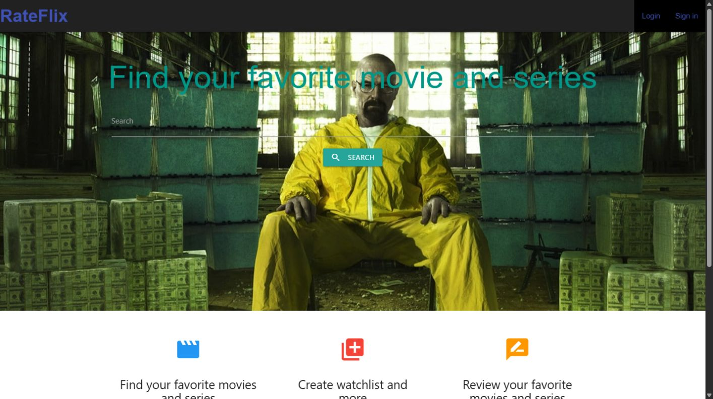
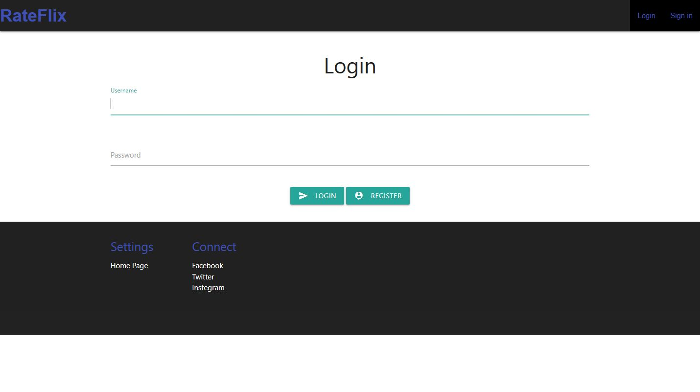

# Movie Review Platform

Film ve dizileri keşfedip izleme listesi ve kişisel değerlendirmeler oluşturmaya yarayan web uygulaması.

Film ve dizileri OMDb üzerinden arayıp izleme listeleri oluşturmak, puan vermek ve yorum yazmak için geliştirilmiş Django web uygulaması. Kimlik doğrulama, kullanıcı profilleri ve yerel veritabanı akışını gösteren bir öğrenme projesidir.

## Özellikler

- OMDb üzerinden film ve dizi arama; sayfalama ve detay sayfaları
- Kayıt, giriş, profil ve profil resmi
- İzlenenler ve daha sonra izlenecekler listesi
- Puan, inceleme, yorum ve beğeni işlemleri
- Django yönetim paneli

**Teknolojiler:** Python, Django 5, SQLite, Requests, Pillow, Materialize CSS.

## Ekran görüntüleri

| Ana sayfa | Giriş |
| --- | --- |
|  |  |

## Yerel kurulum

```bash
python -m venv .venv
source .venv/bin/activate
pip install -r requirements.txt
cd django/django_projesi/film_dizi_puanlama_website
cp .env.example .env
python manage.py migrate
python manage.py runserver
```

Windows'ta sanal ortamı `.venv\Scripts\activate` ile açın ve `cp` yerine `copy` kullanın. OMDb sağlayıcısından bir API anahtarı alıp `.env` içindeki `OMDB_API_KEY` değerini doldurun; ayrıca farklı bir `DJANGO_SECRET_KEY` belirleyin. Uygulama: `http://127.0.0.1:8000/movie/`.

Testler için aynı dizinde `python manage.py check` ve `python manage.py test` çalıştırın. Yerel veritabanı, API anahtarları ve yüklenen kullanıcı dosyaları Git'e eklenmemelidir.

## Lisans

MIT.
